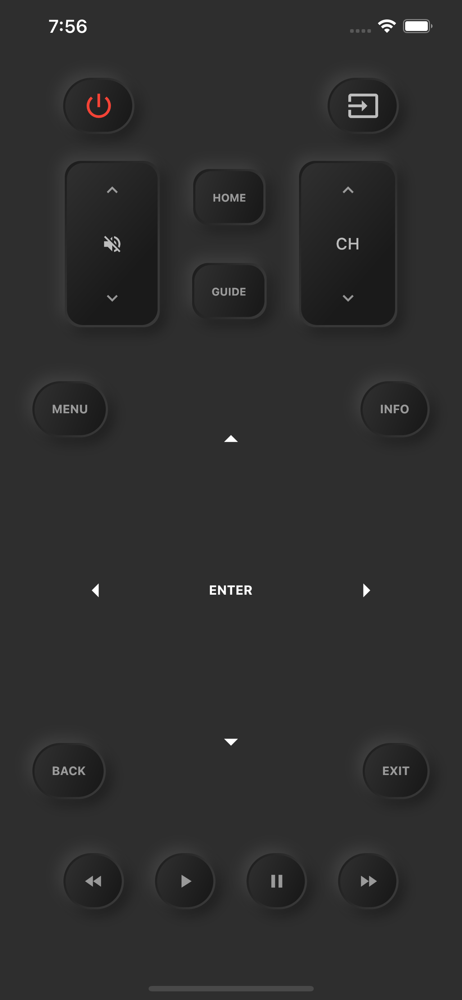

# Changelog
1. Added network permission for Android build
2. Change App label for Android build
3. Added wake-on-lan (hardcoding IP and MAC required)
4. Added token saving
5. Created custom layout

# Flutter remote controller for Smart TVs models (2016 and up)

A dart implementation for [samsungtv](https://github.com/christian-bromann/samsungtv) by [Christian Bromann](https://github.com/christian-bromann)

Inspired from [Universal Remote](https://apps.apple.com/us/app/universal-remote-tv-smart/id1401880138)

You can discover Samsung Smart TVs in your network using the discover button. It uses the UPNP protocol to lookup services.
Arrows | Numpad
:-------------------------:|:-------------------------:|

## License

This project is licensed under the MIT License - see the [LICENSE.md](LICENSE.md) file for details
